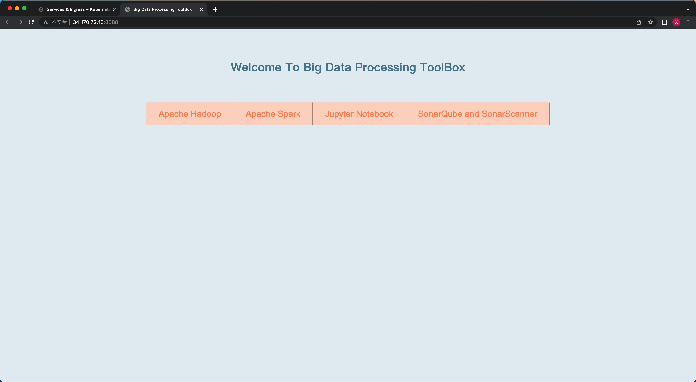

# Big Data Processing ToolBox
14848 Final Project Option 1

Team Member
- Tongxuan Gao (tongxuag)
- Xinman Zhang (xinmanz)

Video Walkthrough: TODO

# How to Reproduce
This method allows you to quickly and easily deploy the application on GCP by running a shell script in Google Cloud Shell.

## Step 1 - Set Up Kubernetes Cluster
- Create Kubernetes Cluster in GCP Cloud Shell by the following command 

    ```gcloud container clusters create --machine-type n1-standard-2 --num-nodes 3 --zone us-central1-a --cluster-version latest finalproject```

- The cluster should look like this.


NOTE: You need to wait until the status shows OK before proceeding.

## Step 2 - Clone Repo in Cloud Shell
- Open Cloud Shell in GCP and clone the repo by doing

    ```git clone https://github.com/txgao/14848_proj1.git```

- Then you should be able to see the `14848_proj1` folder


## Step 3 - Log In Docker Account
- Log in to docker account

    ```docker login```

- The log in process looks like this.


## Step 4 - Deploy Application
- Go to the git folder

    ```cd 14848_proj1```

- Give execution permission to shell script

    ```chmod +x run.sh```
    
- Deploy the application by running a shell script . This shell script will run teh deplotment yaml files of the four services and exctrat their ip-address. Then, it will automatically add these address to the app.py and re-build, deploy the app. 

    ```./run.sh```


- This is the output of running this script.


- You should be able to see all the resources and services after the script is done.

    Deployments


    Services


## Step 5 - Run Application
- Go to `Services & Ingress`, click on the `Endpoints` of `my-app` as shown below.


- Main entrance of the Application


- Click on Apache Hadoop


- Click on Apache Spark


- Click on Jupyter Notebook


- Click on SonarQube and SonarScanner

